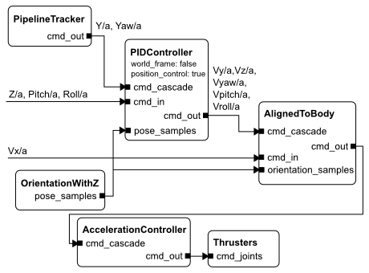
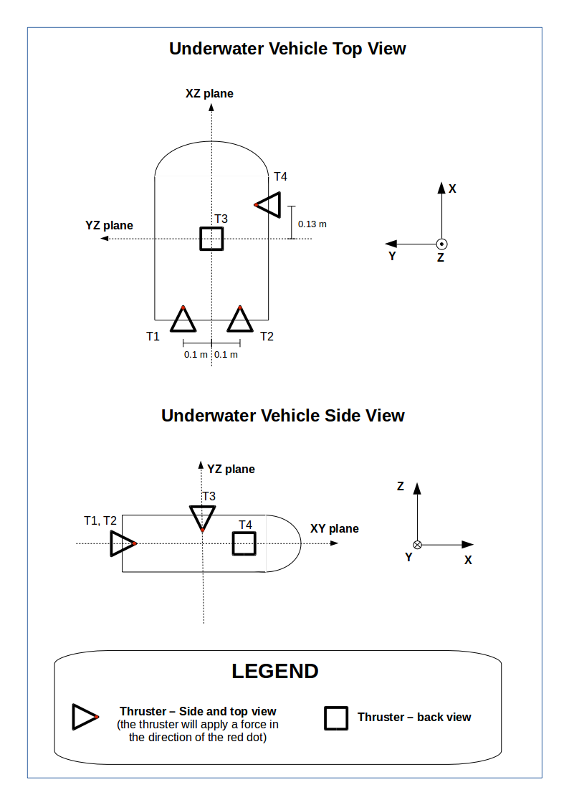

# auv\_control: Generic implementation of an AUV control scheme for hovering AUVs

Assumptions:
 - hovering AUV
 - thrusters placed so that axis can be decoupled (i.e. aligned with one of the
   X, Y or Z axis)

## General presentation

(This is a short description, there is a more detailed description
[at the bottom of this document](#detailed-description))

This package implements a cascaded control concept in which partial control
commands are specified in various frames of reference (described below) and
combined in a safe manner until a full thruster command can be generated.

The three frames of reference are:

 - World: command is specified in the world frame
 - World-aligned body: command is specified in a frame that is basically
   the current vehicle pose but with zero pitch and roll. This is called the
   __aligned__ frame in the rest of this README.
 - Body: [the standard Rock body frame](http://www.ros.org/reps/rep-0103.html)

In world and aligned frames, position and velocities can be specified. In body
frame, only accelerations (i.e. forces). In addition, the Z position, Z velocity
and yaw velocity are identical in world and aligned frames.

Each component in the cascade can deal with multiple inputs. However, the
component will verify that two of its inputs do NOT try to control the same part
of the overall command vector, and will go into INPUT\_COLLIDING exception if it
is the case.

## Example

Let's take the example of a pipeline tracking behaviour, in which a pipeline
detector gives the distance of the pipeline along the Y axis as well as its
orientation within the image, converted to metric measures thanks to the camera
calibration information. The forward speed, roll,
pitch and depth are constant. We assume that a component called OrientationWithZ
provides the full orientation of the system in the world frame as well as its
depth.

## Tuning

This section deals with tuning the controller(s) for a particular system.

Even for basic tuning, one will have to have a generator of a RigidBodyState
that has a valid orientation and depth (such as a IMU + depth sensor). On the
figures, this component would be called OrientationWithZ.  Additional velocity
tuning requires X/Y velocity (DVL) as well as a derivative of the depth sensor.
Position tuning will then require some X/Y position estimator.

### Initial Thruster Matrix

The thruster matrix represents the relative contribution of each thruster for
each axis of control. It's a matrix with dimension (6 x n), where n means the
number of thrusters. The 3 first rows are relative to the forces (surge, sway
and heave) while the 3 last rows are relative to the torques (roll, pitch
and yaw).

The initial values of the thruster matrix can be determinated by looking at the 
geometric position and orientation of each thruster. For each thruster:
 - the contribution in Surge, Sway and Heave are provided by the thruster's
   orientation.
 - the contribution in Pitch, Roll and Yaw  are provided by the relative distance
   of the thruster to the center of mass and the thruster's orientation.

As a simple example we can consider a vehicle with 4 thrusters, like it's shown
below:

 

The thrusters are paralel to one of the axis (X, Y or Z). The thrusters T1 and T2
are placed on the XY plane and oriented to the positive direction of X. They are 
0,1m far from the XZ plane. Since they are oriented in X-axis direction, their 
thrust forces are applied only in this direction, and then the coefficients of the
three first rows of the thruster matrix should be:
							_    _
						   | 1  1 |
						   | 0	0 |
						   |_0	0_|
						   
Which means that these two thrusters don't apply forces neither in Sway (Y) nor
in Heave (Z) directions. For the torque coefficients, besides the orientation 
of the thrusters, one must take into account their distance from the center 
of mass (in this case, it is considered to be in the center of the vehicle). 
Considering their position and orientation, we can tell that they will generate
a torque around the Z axis (Yaw), and the magnitude of these torques will be 
proportional to the distance of the thrusters to the center of mass (in this case
considered to be in the center of the vehicle. Then, the matrix with the 
coefficients for T1 and T2 would be:
							_    	   _
						   |   1  	 1  |
						   |   0	 0  |
						   |   0	 0  |
						   |   0	 0  |
						   |   0	 0  |
						   |_-0.1	0.1_|

It's important to know how to determine the signal of the torque coefficients. 
Let's consider at first the right thruster. If we apply a positive force in this 
thruster, it will generate a torque that will turn the vehicle to the left. 
Considering that the Z axis is point up, we can use the right-hand rule to say
that a positive yaw angle corresponds to a turn to the left. So, that means that
the coefficient should be positive. For the left thruster we can do the same 
analysis, its force generate a torque to the right (negative yaw angle) and 
then its coefficient should be negative.

OBS: The axis convention is very important when determining the torque's
coefficients, so one must be aware of which axis convention is used by the
RigidBodyState's generator (pose estimator).

The complete thruster configuration matrix then would be:

						_    	   				 _
					   |   1  	 1 		0		0 |
					   |   0	 0  	1		0 |
					   |   0	 0  	0	   -1 |
					   |   0	 0  	0		0 |
					   |   0	 0  	0		0 |
					   |_-0.1	0.1	   0.13		0_|

For a initial approach, the center of mass can be considered to be in the center
of the body frame, and the distance of the thrusters can be manually measured.
However, this information can also be obtained using Solidworks.

During experimental tests the thruster matrix can be adjusted in order to be
possible to perform independent movements, e.g., a movement in sway without
angle turning in yaw.

### Initial Z Control

The most important bit that needs to be calibrated first is depth control. The
other parts of the control really can't be tuned without that.

Starting with the initial thruster matrix described above, apply a downwards
force to the AccelerationController and tune until the system goes down more or
less keeping horizontal (you need to modify the third line of the thruster
matrix).

TODO: figure

To then get a proper controller, one has to tune a PIDController
preferably in body frame and position mode. Only the
Z controller has to be tuned at this point. Note that it is very likely that the
Z controller requires an integral part to counteract the non-zero boyancy of the
system.

TODO: figure

At this point, the system can keep more or less stable at a given depth. We can
therefore go on with the rest

### Pitch / Roll Control Position

This part should obviously be skipped if your system has not pitch and roll
control capability. It most probably has one since it can hover (some thrusters
are aligned with Z). Simply reuse the loop from the Initial Z Control tuning,
generate a constant depth command and tune the pitch and roll axis PID
controllers. If the AUV is properly balanced, the controllers will not need any
I part.

### Further Tuning

Once the system can be controlled in Pitch, Roll and Z, tuning other controllers
gets pretty straightforward. Caveats / Tips:

 - the same tuning applies to the PID controller in position mode, regardless of
   whether the command is interpreted in world or aligned frame, as the command
   is always converted to world internally.
 - it is possible to introduce velocity controllers gradually by introducing a
   velocity PIDController in the loop for some axis while keeping the existing
   PIDController for the already tuned axis.

## General Concept (#detailed-description)

### Frame Definitions

C is the AUV center of gravity

World: the world frame (O, Xw, Yw, Zw) is a cartesian, right-handed, frame
aligned with the local tangent to the earth surface. It is aligned with the
local NWU UTM coordinates. The origin position is in general arbitrary, but
should in practice be chosen so that its altitude is at sea level.

Body: the body frame is a (C, Xb, Yb, Zb) cartesian, right-handed, frame,
where Xb is going towards the AUV’s forward direction, Yb to the left and Zb
to the top.

c the world-aligned body frame is a (C, Xa, Ya, Za) cartesian, right-handed,
frame. This frame can be seen as the world to body transformation in which the
pitch and roll angles are reset to zero. 

This frame can be constructed from the world and body frames as follows:
Xa’s support line is defined by the intersection of the planes defined by (C,
Xb, Zw) and (C, Xw, Yw). If Zw and Xb are colinear, Zb is used instead of
Xb.
Xa’s direction is the same as Xb’s direction (i.e. dot(Xa, Xb) > 0). If the
two vectors are orthogonal, the Zb is used instead of Xb to direct Xa.
Za = Zw
Ya is built to form a right-handed cartesian frame.

Note: the construction is non-continuous if you go towards pitch and roll angles
close to 90 degrees because of ambiguities in the interpretation of the euler
angles. It can be made continuous in practice by adding temporal continuity
logic to the convertion procedure.

### Control Domains

The general control loop is a cascaded control loop. The following input domains
are defined:

 - World: the input is an absolute pose in world frame, or parts of one.
 - World-aligned body: the input is a pose change expressed in the world-aligned
   body. Note that since the world-aligned body is a moving frame, a constant
   command in this domain is not a constant command in world frame.
 - World-aligned body velocity: the input at time t is a velocity expressed in
   the world-aligned body frame at time t considered as a world-fixed frame.
   Note that a constant command in this frame translates into a fixed
   world-frame velocity.
 - Forces and torques: the input is a 3-vector of forces and 3-vector of torques
   to apply on C. These forces and torques are expressed in the vehicle’s body
   frame.

### Datatype

To allow the reuse of different controls across different domains, it has been
decided to use the same datatype for the input and output of each stage of the
cascaded loop.

~~~
struct LinearAngular6DCommand
{
    base::Time time;
    base::Vector3d linear;
    base::Vector3d angular;
};
~~~

The semantic of linear and angular differs w.r.t. the control domain:

 - In the world domain, linear is a (x, y, z) position and angular is a (yaw,
   pitch, roll) expression of an attitude, where (yaw, pitch, roll) are a
   decomposition of the attitude over euler angles using the (Z, Y, X)
   decomposition.
 - in the world-aligned body domain, linear is a (x, y, z) position and angular
   is a (yaw, pitch, roll) expression of an attitude, where (yaw, pitch, roll) are
   a decomposition of the attitude over euler angles using Rock’s standard (Z, Y,
   X) decomposition.
 - in the world-aligned body velocity domain, linear is a (v_x, v_y, v_z)
   velocity and angular is a scaled-axis representation of the system’s angular
   velocity.
 - in the forces and torques domain, linear is the force vector and angular is
   a (T_x, T_y, T_z) torques resp. around the X_b, Y_b and Z_b axis.

In each of these representations, NaN is used to represent the fact that a
controller leaves “free” a certain control parameter, per Rock's RG3. See below
for a description of the validity of such a control input.

